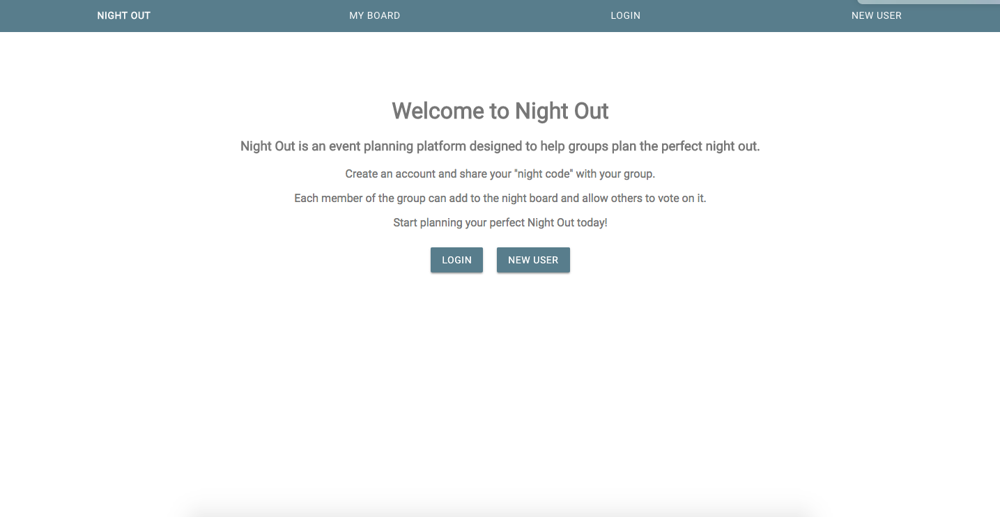

# Night Out

## Night Out is a platform that helps groups plan the perfect night.

We've all been in sutuations where someone in the group wants to do something but another person in the group wants to do something else. Night Out helps solve that problem.

Once users create an account, they can create a night code to share with the group. Anyone with access to the night code can add to the night board and vote on what they want to do for the night.

Frameworks and Technologies used: React, Google Maps API, Material UI, Passport, MongoDB

